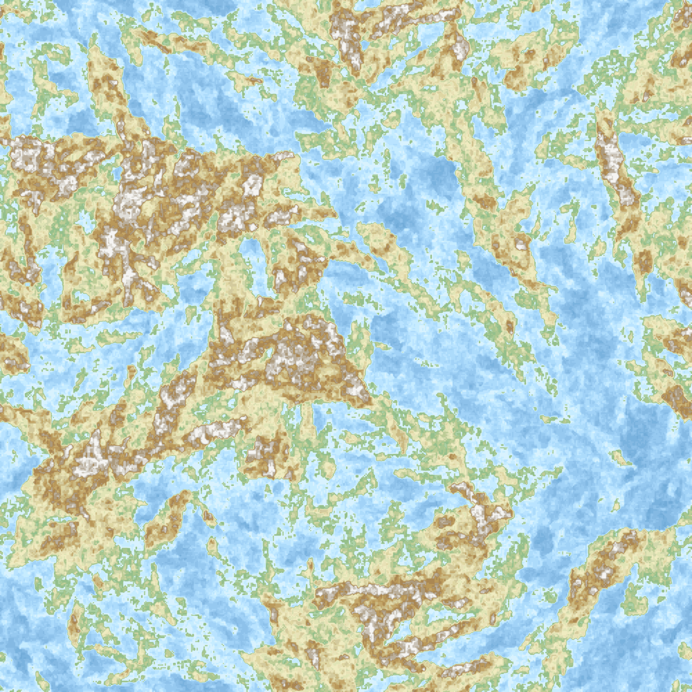

# brownian-map



*500x500, three overlaid seed walks (`surface.generate_multi_spark_surface`,
`n_walks=3`), with isocurves — see below for the exact call.*

Procedural map generation from 2D Brownian-style random surfaces: seed a
grid with a random walk, fill it in by neighbour-averaging plus jitter, map
the result through a bathymetric/hypsometric colour ramp, clean up speckle
noise, and trace elevation contours.

```python
import random
from brownian_map import surface, palette, postprocess, render

random.seed(1)
srf = surface.generate_multi_spark_surface(500, n_walks=3, sparks=150, step=0.12)
norm = palette.normalize_surface(srf, n_bins=20)
clean = postprocess.clean_isolated_points(norm)
iso = postprocess.compute_isocurves(clean, n_levels=28)
render.render_surface(clean, palette.load_palette(), isocurves=iso, path="map.png")
```

That's the exact call behind the image above.

## Install

```
pip install -e ".[notebook]"
```

The `notebook` extra pulls in Jupyter/ipykernel for `notebook.ipynb`; omit
it if you only need the library and CLI.

## CLI

```
python -m brownian_map.cli --dim 300 --sparks 100 --out map.png
```

or, after installing, the `brownian-map` console script does the same
thing. See `python -m brownian_map.cli --help` for all options.

## Notebook

`notebook.ipynb` walks through each pipeline stage (surface generation,
palette normalization, speckle cleanup, isocurves) in isolation, then runs
the same thing end-to-end via `cli.generate_map`. Start with its parameter
glossary for what each argument controls.

## Layout

| Module | Role |
| --- | --- |
| `brownian_map/surface.py` | Raw heightmap generation (row-based and spark-propagation). |
| `brownian_map/palette.py` | Colour ramp loading and surface quantization. |
| `brownian_map/postprocess.py` | Speckle cleanup, isocurve extraction. |
| `brownian_map/rivers.py` | Hill-climbing river tracing, used by `cli.generate_map` internally. Short, unconvincing paths are a known limitation — see its module docstring. |
| `brownian_map/render.py` | Matplotlib rendering. |
| `brownian_map/cli.py` | End-to-end pipeline + `python -m brownian_map.cli` entry point. |
