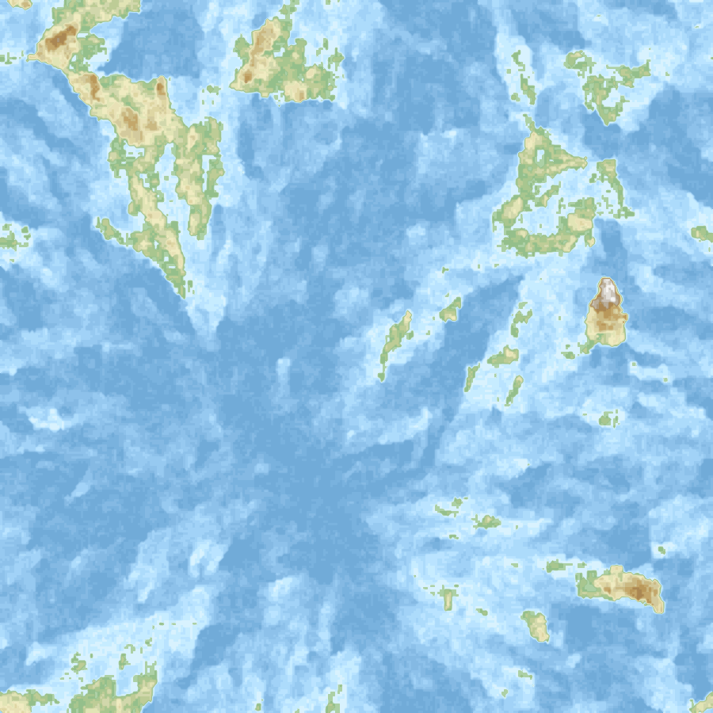

# brownian-map



Procedural map generation from 2D Brownian-style random surfaces: seed a
grid with a random walk, fill it in by neighbour-averaging plus jitter, map
the result through a bathymetric/hypsometric colour ramp, clean up speckle
noise, and trace elevation contours.

The map above is the default pipeline at `--dim 300 --seed 0`, i.e. the
output of section 7 of the notebook:

```python
from brownian_map.cli import generate_map
from brownian_map import render

clean, rgb_palette, isocurves = generate_map(dim=300, sparks=100, step=0.1, n_bins=20, seed=0)
render.render_surface(clean, rgb_palette, isocurves=isocurves, path="docs/map.png")
```

## Install

```
pip install -e ".[notebook]"
```

The `notebook` extra pulls in Jupyter/ipykernel for `notebook.ipynb`; omit
it if you only need the library and CLI.

## CLI

```
python -m brownian_map.cli --dim 300 --sparks 100 --out map.png
```

or, after installing, the `brownian-map` console script does the same
thing. See `python -m brownian_map.cli --help` for all options.

## Algorithm walkthrough

[`docs/spark-fill-algorithm.html`](docs/spark-fill-algorithm.html) is an
illustrated, step-by-step tutorial of the whole pipeline above — one random
walk, grown into a basin, combined with others, quantized, cleaned,
contoured, and rendered — each step with its own figure, no setup required
beyond opening the file. Start here if you want to understand the algorithm
before touching the notebook or the code.

## Notebook

[`spark-fill-notebook.ipynb`](spark-fill-notebook.ipynb) walks through each
pipeline stage (surface generation, palette normalization, speckle cleanup,
isocurves) in isolation, then runs the same thing end-to-end via
`cli.generate_map`. Start with its parameter glossary for what each
argument controls.

Two things worth knowing, both covered there in more detail:

- **`step` is the land-fraction knob.** Higher jitter means rougher terrain
  *and* more land above sea level; the archipelago look above comes from
  keeping it low (`0.1`).
- **A single seed walk gives one basin.** On grids much larger than the
  walk itself, the whole map becomes one basin radiating from it — a visible
  "starburst". `surface.generate_multi_spark_surface` overlays several
  independent walks (cell-wise max) to break that up, at the cost of
  raising land coverage.

## Layout

| Module | Role |
| --- | --- |
| `brownian_map/surface.py` | Raw heightmap generation (row-based and spark-propagation). |
| `brownian_map/palette.py` | Colour ramp loading and surface quantization. |
| `brownian_map/postprocess.py` | Speckle cleanup, isocurve extraction. |
| `brownian_map/render.py` | Matplotlib rendering. |
| `brownian_map/cli.py` | End-to-end pipeline + `python -m brownian_map.cli` entry point. |
| `brownian_map/rivers.py` | Hill-climbing river tracing. Not part of the pipeline — short, unconvincing paths are an inherent limit of hill-climbing over a static surface. Kept for reference; see its module docstring for a sketch of an erosion-based alternative. |
